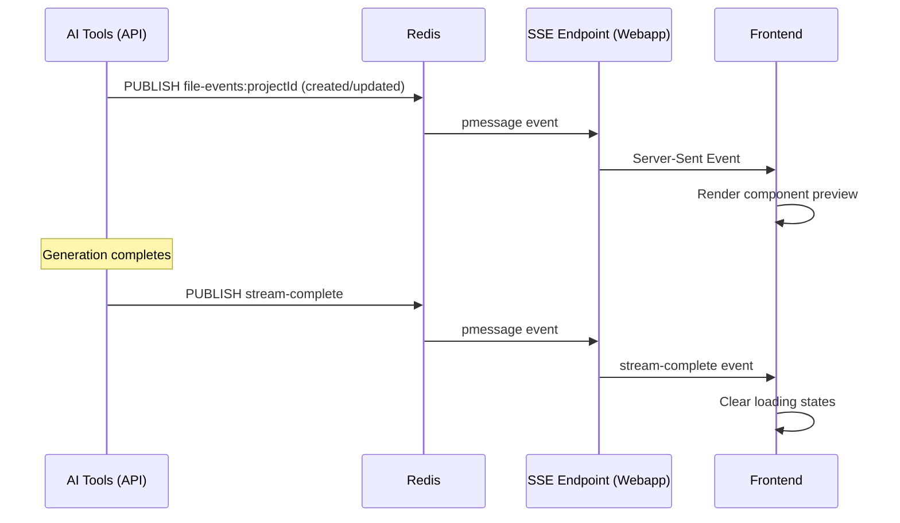

# Redis-based File Streaming for Live Preview

## Overview

This document describes the Redis-based file streaming system that enables live preview functionality when the AI builder is running on a separate API server.

## Problem Statement

When the AI builder was moved from the webapp (`apps/web`) to a separate API server (`apps/api`), the live preview feature broke. The original implementation used an in-process EventEmitter that could only broadcast events within the same Node.js process.

### Original Architecture (Broken)

```
API Server (apps/api)
  └─ AI Tools (createOrEditFiles)
     └─ ❌ No file events emitted

Webapp (apps/web)
  └─ SSE Endpoint (/api/projects/[projectId]/file-stream)
     └─ Listening to local EventEmitter (receives nothing)

Frontend
  └─ EventSource connection
     └─ ❌ No preview updates received
```

### New Architecture (Working)

```
API Server (apps/api)
  └─ AI Tools (createOrEditFiles)
     └─ Publish to Redis channel
        └─ Redis Pub/Sub
           └─ Webapp subscribes to channel
              └─ SSE Endpoint forwards to frontend
                 └─ Frontend renders live preview ✅
```

## Implementation

### 1. Redis File Events Publisher (API Server)

**Location:** `apps/api/src/services/redis-file-events.ts`

- Publishes file creation/update events to Redis
- Handles connection failures gracefully (queues messages)
- Uses Redis channels: `file-events:{projectId}`

```typescript
await redisFileStreamPublisher.emitFileCreation({
  projectId: context.projectId,
  filePath: path,
  content,
  timestamp: Date.now(),
  action: isEdit ? "updated" : "created",
});
```

### 2. Redis File Events Subscriber (Webapp)

**Location:** `apps/web/src/lib/redis-file-events.ts`

- Subscribes to Redis channels via pattern matching
- Buffers events for reconnecting clients
- Emits events locally to SSE endpoint
- Falls back to local-only mode if Redis unavailable

### 3. AI Tools Integration

**Location:** `apps/api/src/services/ai-tools.ts:982-1009`

The `createOrEditFiles` tool emits file events after successfully writing files:

```typescript
// Emit file creation event for live preview (only for React components)
if (
  path.endsWith(".tsx") &&
  path.startsWith("src/components/") &&
  !path.includes("/", 16) // No subdirectories
) {
  await redisFileStreamPublisher.emitFileCreation({
    projectId: context.projectId,
    filePath: path,
    content,
    timestamp: Date.now(),
    action: isEdit ? "updated" : "created",
  });
}
```

### 4. SSE Endpoint Update

**Location:** `apps/web/src/app/api/projects/[projectId]/file-stream/route.ts`

Changed from local `fileStreamEmitter` to `redisFileStreamEmitter`:

```typescript
import { redisFileStreamEmitter } from "@/lib/redis-file-events";

// Subscribe to Redis events
const unsubscribe = redisFileStreamEmitter.onFileCreation(
  projectId,
  sendEvent,
);
```

### 5. Frontend (Unchanged)

**Location:** `apps/web/src/modules/projects/ui/view/v3-project-view.tsx:282-337`

The frontend SSE connection remains unchanged - it still connects to the same endpoint and receives events the same way.

## Configuration

### Environment Variables

Both webapp and API server need Redis configuration:

```bash
# Required for cross-process file streaming
REDIS_URL=redis://localhost:6379
```

### Without Redis

If `REDIS_URL` is not configured:
- API server will warn but continue (no file streaming)
- Webapp falls back to local-only mode (works for in-process chat only)
- Live preview will not work when using the API server

## Event Flow



## Stream Completion

When the AI finishes generating files, it emits a special `stream-complete` event:

**API Server** (`apps/api/src/routes/chat.ts:752-760`):
```typescript
await redisFileStreamPublisher.emitStreamComplete(projectId);
```

**Frontend** (`apps/web/src/modules/projects/ui/view/v3-project-view.tsx:307-315`):
```typescript
if (data.action === "stream-complete") {
  setIsStreamingFiles(false);
  setHasStartedStreaming(false);
  return;
}
```

This ensures the preview loading animation clears properly when generation is complete.

## File Filtering

Only React components in the root of `src/components/` are streamed:

- ✅ `src/components/Button.tsx`
- ❌ `src/components/ui/Button.tsx` (subdirectory)
- ❌ `src/App.tsx` (not in components)
- ❌ `src/components/types.ts` (not .tsx)

This matches the original behavior and prevents overwhelming the preview with every file change.

## Benefits

1. **Cross-Process Communication**: Works across separate servers/processes
2. **Scalability**: Multiple API servers can emit to the same Redis
3. **Reliability**: Event buffering for reconnecting clients
4. **Graceful Degradation**: Falls back to local mode if Redis unavailable
5. **Performance**: Redis Pub/Sub is highly optimized for real-time messaging

## Monitoring

Both modules log extensively for debugging:

**API Server:**
```
[redis-file-events] Emitting file creation event
[redis-file-events] Published file event to Redis
```

**Webapp:**
```
[RedisFileStreamEmitter] Received Redis event for {projectId}
[file-stream] Sent event for file: {filePath}
```

## Migration Notes

### Removed: Local File Stream Emitter

The old `apps/web/src/lib/file-stream-events.ts` module has been **removed** as it only worked for in-process events and couldn't support the separated API server architecture.

All file streaming now uses Redis Pub/Sub, including the legacy webapp chat endpoint (`apps/web/src/lib/ai/v2-tools.ts`).

## Testing

To test the file streaming:

1. Ensure Redis is running: `redis-cli ping` → `PONG`
2. Set `REDIS_URL` in both apps
3. Start both servers:
   ```bash
   pnpm dev:api
   pnpm dev:web
   ```
4. Create a project and send a chat message
5. Watch the logs for Redis events
6. Verify live preview updates in the frontend

## Troubleshooting

### No preview updates

1. Check Redis connection: `redis-cli ping`
2. Verify `REDIS_URL` is set in both apps
3. Check logs for "Redis publisher connected"
4. Ensure file path matches filter criteria (React components only)

### Redis connection errors

```
[RedisFileStreamEmitter] Publisher error: connect ECONNREFUSED
```

- Redis is not running or not accessible
- Check `REDIS_URL` value
- Start Redis: `redis-server`

### Events not reaching frontend

1. Check SSE connection in browser DevTools → Network
2. Verify SSE endpoint logs show "Received Redis event"
3. Check that frontend EventSource is connected
4. Verify project ID matches across all components

## Future Improvements

1. **Rate Limiting**: Prevent flooding with rapid file changes
2. **Compression**: Compress large file contents before publishing
3. **Persistence**: Store events in Redis streams for replay
4. **Metrics**: Track event volume and latency
5. **Batching**: Batch multiple file changes into single events
